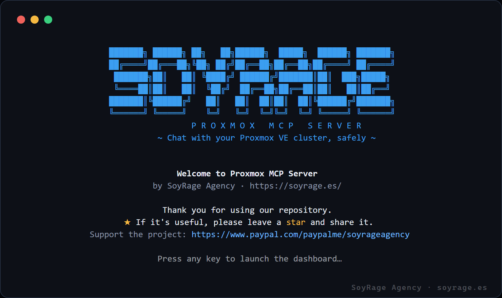
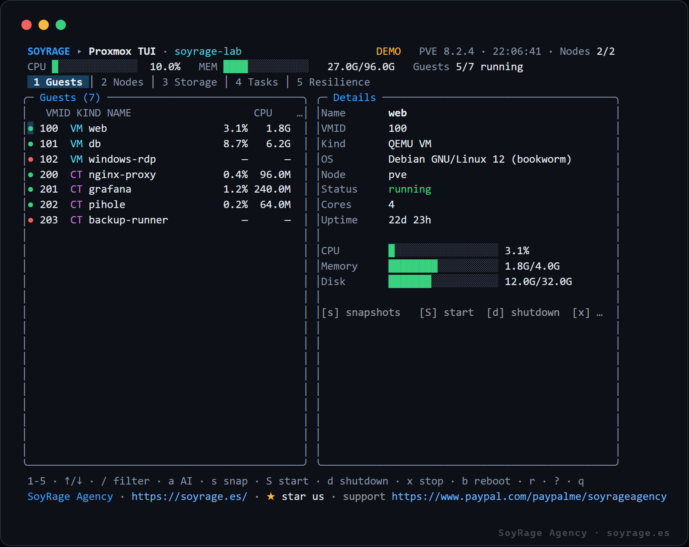

<div align="center">

<a href="https://soyrage.es/">
  
</a>

<br/>

# 🖥️ Proxmox MCP Server

**Chat with your Proxmox VE cluster.** A [Model Context Protocol](https://modelcontextprotocol.io) server that turns any MCP‑capable AI — Claude Desktop, Cursor, Continue, Zed — into a natural‑language operator for **Proxmox Virtual Environment**: nodes, QEMU VMs, LXC containers, storage, tasks and snapshots.

*“List my VMs and which are down.” · “How much RAM is `web` (VMID 101) using?” · “Snapshot `db` before I upgrade it.” · “Gracefully shut down container 200.”*

<br/>

[](https://github.com/soyrageagency/proxmox-mcp-server/actions/workflows/ci.yml)
[](https://nodejs.org)
[](https://www.typescriptlang.org/)
[](https://modelcontextprotocol.io)
[](https://pve.proxmox.com/pve-docs/api-viewer/)
[](./LICENSE)
[](https://www.paypal.com/paypalme/soyrageagency)

### Designed, built & maintained by **[SoyRage Agency](https://soyrage.es/)** · **https://soyrage.es/**

**⚡ New here? Install in one command → [Quick install](#-quick-install-one-command).**  ·  **☕ [Support the project](https://www.paypal.com/paypalme/soyrageagency)**

</div>

> 🐳 Looking for the Docker equivalent? See the sister project **[docker-mcp-server](https://github.com/soyrageagency/docker-mcp-server)** — same philosophy, for Docker & Compose.

---

## 📑 Table of contents

- [Quick install (one command)](#-quick-install-one-command)
- [What is this?](#-what-is-this)
- [Feature overview](#-feature-overview)
- [How it works](#-how-it-works)
- [Requirements](#-requirements)
- [Installation](#-installation)
- [The terminal UI (TUI)](#-the-terminal-ui-tui)
- [Create a Proxmox API token](#-create-a-proxmox-api-token)
- [Connecting to your AI client](#-connecting-to-your-ai-client)
- [Configuration reference](#-configuration-reference)
- [TLS & self‑signed certificates](#-tls--self-signed-certificates)
- [Security model & networking](#-security-model--networking)
- [Complete tool reference](#-complete-tool-reference)
- [Example conversations](#-example-conversations)
- [Modular plugin architecture](#-modular-plugin-architecture)
- [Project structure](#-project-structure)
- [Development](#-development)
- [Troubleshooting & FAQ](#-troubleshooting--faq)
- [Roadmap](#-roadmap)
- [Support the project](#-support-the-project)
- [Credits & License](#-credits--license)

---

## ⚡ Quick install (one command)

New to this? The installer clones the project, builds it, and runs a **guided setup wizard** — you just **paste your Proxmox address and API token**, it **tests the connection**, and writes everything (`.env` + Claude Desktop config) for you. You only need [Git](https://git-scm.com/) and [Node.js ≥ 18](https://nodejs.org/).

**Windows (PowerShell):**
```powershell
irm https://raw.githubusercontent.com/soyrageagency/proxmox-mcp-server/main/install.ps1 | iex
```

**macOS / Linux:**
```bash
curl -fsSL https://raw.githubusercontent.com/soyrageagency/proxmox-mcp-server/main/install.sh | bash
```

The wizard asks a few simple questions and looks like this:

```text
  Proxmox address (e.g. https://192.168.1.10:8006): https://10.0.0.11:8006
  Do you have an API token? (Y/n): y
  Token ID (user@realm!name, e.g. root@pam!mcp): root@pam!mcp
  Token secret (paste the UUID): ••••••••-••••-••••-••••-••••••••••••
  Verify the TLS certificate? (most Proxmox use self-signed → No) (y/N): n
  Read-only mode? (view only — safest) (y/N): n

  Testing the connection…
  ✓ Connected to Proxmox VE (8.2.4)
  ✓ Saved credentials to .env
  ✓ Added the "proxmox" server in your Claude config.

  All set!  →  restart Claude Desktop and ask "List my Proxmox VMs."
```

Already cloned the repo? Just run **`npm run setup`**. Don't have a token yet? See [Create a Proxmox API token](#-create-a-proxmox-api-token) (2 minutes). Want to try it with **no cluster at all**? Jump to [demo mode](#-try-it-instantly--demo-mode-no-proxmox-needed).

The installer **backs up** and **merges** your existing config, so other MCP servers are preserved.

> 💙 If this saves you time, please [**support the project on PayPal**](https://www.paypal.com/paypalme/soyrageagency) and drop a ⭐.

---

## 🧭 What is this?

The **Model Context Protocol (MCP)** is an open standard that lets AI assistants talk to external tools over a well‑defined JSON‑RPC interface. **Proxmox MCP Server** is an MCP *server* that speaks that protocol over **stdio** and exposes your [Proxmox VE](https://www.proxmox.com/en/proxmox-virtual-environment) cluster as a set of safe, richly‑described tools.

Point any MCP‑capable assistant at it and you can operate your virtualization stack **in plain language** — the model reads each tool's schema, decides which to call against the Proxmox REST API, and reports the results back to you. Built for **home‑labbers** and **sysadmins** who'd rather ask than remember `qm` and `pct` flags.

---

## 🚀 Feature overview

| Area | Capabilities |
| --- | --- |
| 🧭 **Cluster** | List nodes with load, node status, cluster quorum/membership, and a consolidated `cluster_resources` view. |
| 🖥️ **Guests** | List QEMU **VMs** and **LXC** containers (filter by kind / running), live status, full config, and **guest OS** (via the QEMU agent — name, version, IPs). |
| ⚙️ **Lifecycle** | Start · graceful **shutdown** · hard **stop** · reboot · **suspend/resume** — for VMs and containers. |
| 🚚 **Management** | **Migrate** to another node · **clone** (from templates) · **resize** CPU/RAM · **delete**. |
| 📦 **Backups** | **Backup** (vzdump) · **list** archives · **restore** into a VMID. |
| 🧱 **Provisioning** | **List templates/ISOs** · **create** LXC containers and QEMU VMs. |
| 📸 **Snapshots** | List, **create** (optionally with RAM), **rollback** and **delete** snapshots. |
| 💾 **Storage** | List storages per node with type, content and usage. |
| 🧾 **Tasks** | Recent task log per node (backups, migrations, actions…). |
| ⌨️ **Terminal UI** | A creative, lazydocker‑style TUI (`proxmox-mcp-tui`) with live gauges, guest OS, and one‑key actions. |
| 🛡️ **Safety** | Global **read‑only** mode · **guest allowlist** (by VMID or name) · TLS verification control. |
| 🔐 **Auth** | API **token** (recommended) or username/password **ticket** auth. |
| 🧩 **Modular** | Every capability is a toggleable **plugin** — expose exactly the surface you want. |
| 🧱 **Engineering** | 100% TypeScript, strict mode · tiny dependency surface · stderr‑only logging. |

---

## 🛠️ How it works

```
                 ┌──────────────────────────────────────────────┐
   You  ◀──────▶ │  AI assistant (Claude / Cursor / Continue …)  │
                 └───────────────────────┬──────────────────────┘
                              stdio · JSON‑RPC (MCP)
                 ┌───────────────────────▼──────────────────────┐
                 │              Proxmox MCP Server               │
                 │   config → auth → tool call → Proxmox API     │
                 └───────────────────────┬──────────────────────┘
                          HTTPS · /api2/json (token or ticket)
                 ┌───────────────────────▼──────────────────────┐
                 │        Proxmox VE node / cluster (:8006)      │
                 └───────────────────────────────────────────────┘
```

The server calls the **Proxmox VE REST API** (`https://<host>:8006/api2/json`). It resolves each guest's node automatically from `/cluster/resources`, so you address VMs and containers simply by **VMID or name** — no need to know which node they live on.

---

## ✅ Requirements

| Requirement | Notes |
| --- | --- |
| **Node.js ≥ 18** | ES modules + global `fetch`. Node 20+ recommended. |
| **A Proxmox VE 7/8 node or cluster** | Reachable on its API port (`8006`). |
| **An API token** (recommended) | Or a user/password. See [Create a Proxmox API token](#-create-a-proxmox-api-token). |
| **An MCP client** | Claude Desktop, Cursor, Continue, Zed, or the MCP Inspector. |

---

## 📦 Installation

```bash
git clone https://github.com/soyrageagency/proxmox-mcp-server.git
cd proxmox-mcp-server
npm install
npm run build
```

### 🧪 Try it instantly — demo mode (no Proxmox needed)

Want to evaluate it right now without a cluster? Run in **demo mode** — the
server serves a believable 2‑node lab (VMs, containers, storage, snapshots):

```bash
npm run build
PROXMOX_MCP_DEMO=true npm run inspect     # explore every tool in the MCP Inspector
```

Or point Claude Desktop at it with `"PROXMOX_MCP_DEMO": "true"` in the `env`
block and ask *“List my Proxmox VMs and containers.”* You'll get output like:

```
VMID  KIND  NAME           NODE  STATUS   CPU   MEMORY          UPTIME
100   VM    web            pve   running  3.1%  1.8 GB/4.0 GB   22d 23h
101   VM    db             pve   running  8.7%  6.2 GB/8.0 GB   22d 23h
200   CT    nginx-proxy    pve   running  0.4%  96.0 MB/512 MB  22d 22h
201   CT    grafana        pve   running  1.2%  240 MB/2.0 GB   13d 21h
```

When you're ready, set `PROXMOX_MCP_DEMO=false` and add your real host + token.

### With a real cluster

```bash
npm run inspect     # after setting PROXMOX_HOST + token (see below)
```

---

## ⌨️ The terminal UI (TUI)

Prefer the terminal? Launch **`proxmox-mcp-tui`** — a creative, [lazydocker](https://github.com/jesseduffield/lazydocker)‑style dashboard for your cluster that opens with a SoyRage Agency welcome, then drops you into a live, keyboard‑driven view of your VMs and containers. Hand‑rolled ANSI, **zero UI dependencies**.

```bash
npm run build
npm run tui        # → interactive terminal dashboard
npm run tui:demo   # same, with realistic mock data (no cluster needed)
```

<div align="center">

### A warm welcome


### Live dashboard — guests, OS, gauges & one‑key actions


<sub>Rendered in <b>demo mode</b> · watermarked © SoyRage Agency · soyrage.es</sub>

</div>

**Keys:** `↑/↓` (or `j/k`) navigate · `s` snapshots · `S` start · `d` shutdown · `x` stop · `b` reboot · `r` refresh · `q` quit. VMs are cyan, containers magenta; the details pane shows the guest **OS**, CPU/memory/disk gauges and uptime. Read‑only mode hides the action keys.

---

## 🔑 Create a Proxmox API token

An API token is the safest way to authenticate (no password stored, revocable, scopable).

1. In the Proxmox web UI go to **Datacenter → Permissions → API Tokens → Add**.
2. Pick a **User** (e.g. `root@pam`) and a **Token ID** (e.g. `mcp`). Copy the generated **secret** — it's shown only once.
   - Your `PROXMOX_TOKEN_ID` is then **`root@pam!mcp`**.
3. Give the token permissions. For full control assign the `PVEAdmin` role at path `/`; for **read‑only** use `PVEAuditor`. (Uncheck *Privilege Separation* to inherit the user's privileges, or add an ACL for the token.)
4. Put the values in your MCP client config / `.env`:
   ```
   PROXMOX_HOST=https://192.168.1.10:8006
   PROXMOX_TOKEN_ID=root@pam!mcp
   PROXMOX_TOKEN_SECRET=xxxxxxxx-xxxx-xxxx-xxxx-xxxxxxxxxxxx
   ```

> Prefer least privilege: pair a `PVEAuditor` token with `PROXMOX_MCP_READONLY=true` for a safe, view‑only assistant.

---

## 🔌 Connecting to your AI client

Add the server to your MCP client. Example for **Claude Desktop**
(`%APPDATA%\Claude\claude_desktop_config.json` on Windows,
`~/Library/Application Support/Claude/claude_desktop_config.json` on macOS):

```jsonc
{
  "mcpServers": {
    "proxmox": {
      "command": "node",
      "args": ["/absolute/path/to/proxmox-mcp-server/dist/index.js"],
      "env": {
        "PROXMOX_HOST": "https://192.168.1.10:8006",
        "PROXMOX_TOKEN_ID": "root@pam!mcp",
        "PROXMOX_TOKEN_SECRET": "xxxxxxxx-xxxx-xxxx-xxxx-xxxxxxxxxxxx",
        "PROXMOX_VERIFY_TLS": "false",
        "PROXMOX_MCP_READONLY": "false"
      }
    }
  }
}
```

A ready‑to‑edit copy lives in [`examples/claude_desktop_config.json`](./examples/claude_desktop_config.json). Restart your client and ask: *“What Proxmox nodes and VMs do I have?”* — the assistant will greet you on behalf of SoyRage Agency and take it from there.

---

## ⚙️ Configuration reference

Every setting is an environment variable. A local **`.env`** is loaded automatically; a JSON **config file** (`proxmox-mcp.config.json`) provides defaults. Precedence (low → high): defaults → config file → `.env` → environment. See [`.env.example`](./.env.example).

| Variable | Default | Description |
| --- | --- | --- |
| `PROXMOX_HOST` | — | API base URL, e.g. `https://192.168.1.10:8006`. |
| `PROXMOX_TOKEN_ID` | — | API token id `user@realm!tokenname` (recommended). |
| `PROXMOX_TOKEN_SECRET` | — | API token secret (UUID). |
| `PROXMOX_USER` | — | `user@realm` for ticket auth (used only if no token). |
| `PROXMOX_PASSWORD` | — | Password for ticket auth. |
| `PROXMOX_VERIFY_TLS` | `false` | Verify the node's TLS certificate. |
| `PROXMOX_MCP_READONLY` | `false` | Hide **all** state‑changing tools. |
| `PROXMOX_MCP_DEMO` | `false` | Serve fabricated demo data (no real host needed). |
| `PROXMOX_MCP_ALLOWLIST` | — | Comma‑separated VMIDs/names the AI may touch (empty = all). |
| `PROXMOX_MCP_PLUGINS` | — | Load **only** these plugins (empty = all). |
| `PROXMOX_MCP_DISABLED_PLUGINS` | — | Disable these plugins. `about` is locked. |
| `PROXMOX_MCP_LOG_LEVEL` | `info` | `debug` \| `info` \| `warn` \| `error`. |
| `PROXMOX_MCP_CONFIG` | `proxmox-mcp.config.json` | Path to the optional JSON config file. |

---

## 🔒 TLS & self‑signed certificates

Proxmox ships a **self‑signed certificate** by default, so `PROXMOX_VERIFY_TLS=false` (the default) is expected for most home‑labs — the connection is still encrypted, just not certificate‑verified. TLS control is per‑request (via `undici`), so it does **not** disable verification globally for your process.

Set `PROXMOX_VERIFY_TLS=true` only when your node presents a certificate your system trusts (e.g. a Let's Encrypt cert, or an internal CA / reverse proxy in front of `:8006`).

---

## 🛡️ Security model & networking

This server can control your infrastructure — treat access like `root` SSH.

| Control | What it does |
| --- | --- |
| **Read‑only mode** (`PROXMOX_MCP_READONLY=true`) | Hides every lifecycle/snapshot‑mutating tool. Pair with a `PVEAuditor` token. |
| **Guest allowlist** (`PROXMOX_MCP_ALLOWLIST`) | Restricts *all* guest tools to matching VMIDs/names; anything else returns a clear error. |
| **Scoped API token** | Grant the token only the privileges it needs; revoke instantly from the UI. |
| **Least privilege** | `PVEAuditor` + read‑only = a safe, view‑only assistant. |

**Networking:** the Proxmox API listens on `:8006`. Reach a remote node **over a VPN** ([WireGuard](https://www.wireguard.com/) / [Tailscale](https://tailscale.com/)) rather than exposing `8006` to the Internet. The MCP server runs **locally** beside your AI client and connects out to Proxmox — it opens no inbound ports of its own.

### Safety recipes

```bash
# View-only assistant (great for demos / dashboards)
PROXMOX_MCP_READONLY=true          # + a PVEAuditor token

# Only let the AI manage two specific guests
PROXMOX_MCP_ALLOWLIST=101,web

# Expose only cluster/guest insight, no storage/tasks
PROXMOX_MCP_PLUGINS=nodes,guests,cluster
```

---

## 🧰 Complete tool reference

Tools marked **W** change state and are **hidden** when `PROXMOX_MCP_READONLY=true`.
Guests are addressed by **VMID or name**.

### Identity

| Tool | Description |
| --- | --- |
| `about` | Credits, license and the SoyRage Agency welcome banner. |
| `list_plugins` | The modular plugins and whether each is enabled. |

### Insight (read‑only)

| Tool | Parameters | Description |
| --- | --- | --- |
| `list_nodes` | — | Cluster nodes with status, CPU and memory. |
| `node_status` | `node` | Detailed status of one node. |
| `list_guests` | `kind?` (`qemu`/`lxc`), `runningOnly?` | All VMs & containers with live stats. |
| `guest_status` | `guest` | Live status of one VM/container. |
| `guest_config` | `guest` | Full configuration of one guest. |
| `guest_osinfo` | `guest` | The guest's **operating system** (agent name/version + IPs). |
| `list_storage` | `node` | Storages on a node with usage. |
| `list_tasks` | `node`, `limit?` | Recent tasks on a node. |
| `cluster_status` | — | Cluster membership & quorum. |
| `cluster_resources` | `type?` | Consolidated nodes/guests/storage view. |
| `list_snapshots` | `guest` | Snapshots of a VM/container. |
| `list_backups` | `node?`, `storage?` | vzdump backup archives with VMID, size, age. |
| `list_templates` | `node?` | Container templates (vztmpl) and install ISOs. |

### Lifecycle (**W**)

| Tool | Parameters | Description |
| --- | --- | --- |
| `start_guest` | `guest` | Power on a VM/container. |
| `shutdown_guest` | `guest`, `timeout?` | Graceful ACPI/OS shutdown (preferred). |
| `stop_guest` | `guest` | Hard stop (power‑cord). Destructive — confirm first. |
| `reboot_guest` | `guest` | Graceful reboot. |
| `suspend_guest` | `guest`, `toDisk?` | Pause a VM in RAM (or hibernate to disk). |
| `resume_guest` | `guest` | Resume a suspended VM. |

### Management (**W**)

| Tool | Parameters | Description |
| --- | --- | --- |
| `migrate_guest` | `guest`, `target`, `online?` | Move a guest to another node (live if running). |
| `clone_guest` | `guest`, `newid`, `name?`, `full?`, `target?` | Clone a VM/CT (e.g. from a template). |
| `set_guest_resources` | `guest`, `cores?`, `memory?` | Quickly change CPU cores / RAM (MB). |
| `backup_guest` | `guest`, `storage`, `mode?`, `compress?` | Create a vzdump backup to a storage. |
| `delete_guest` | `guest`, `confirm`, `purge?` | Destroy a guest (guarded: `confirm` must equal the VMID). |

### Backups & provisioning (**W**)

| Tool | Parameters | Description |
| --- | --- | --- |
| `restore_backup` | `volid`, `vmid`, `node?`, `storage?`, `force?` | Restore a vzdump archive into a VMID. |
| `create_container` | `vmid`, `ostemplate`, `storage`, `hostname?`, `cores?`, `memory?`, `diskGb?`, … | Create an LXC container from a template. |
| `create_vm` | `vmid`, `storage`, `name?`, `diskGb?`, `cores?`, `memory?`, `iso?`, `ostype?`, … | Create a QEMU VM (with a disk + optional install ISO). |

### Snapshots (**W**)

| Tool | Parameters | Description |
| --- | --- | --- |
| `create_snapshot` | `guest`, `name`, `description?`, `withRam?` | Take a snapshot (optionally with VM RAM). |
| `rollback_snapshot` | `guest`, `name` | Revert to a snapshot (destructive). |
| `delete_snapshot` | `guest`, `name` | Remove a snapshot. |

---

## 💬 Example conversations

| You say… | The assistant calls… |
| --- | --- |
| “Show me all my VMs and containers.” | `list_guests` |
| “Which containers are running?” | `list_guests { kind: "lxc", runningOnly: true }` |
| “Is node pve healthy?” | `node_status { node: "pve" }` |
| “How is VMID 101 doing?” | `guest_status { guest: "101" }` |
| “Snapshot db before the upgrade.” | `create_snapshot { guest: "db", name: "pre-upgrade" }` |
| “Gracefully shut down container 200.” | `shutdown_guest { guest: "200" }` |
| “How full is storage on pve?” | `list_storage { node: "pve" }` |
| “What happened on pve recently?” | `list_tasks { node: "pve" }` |
| “Who built this?” | `about` |

---

## 🧩 Modular plugin architecture

The server is assembled from independent **plugins**, each owning one capability group; which load is driven entirely by configuration. The `about` plugin is **locked** — it carries the SoyRage Agency identity and cannot be disabled.

| Plugin | Category | Type | Tools |
| --- | --- | --- | --- |
| `about` 🔒 | identity | read | `about`, `list_plugins` |
| `nodes` | nodes | read | `list_nodes`, `node_status` |
| `guests` | guests | read | `list_guests`, `guest_status`, `guest_config`, `guest_osinfo` |
| `storage` | storage | read | `list_storage` |
| `tasks` | tasks | read | `list_tasks` |
| `cluster` | cluster | read | `cluster_status`, `cluster_resources` |
| `snapshots` | snapshots | read/write | `list_snapshots`, `create/rollback/delete_snapshot` |
| `lifecycle` | lifecycle | write | `start/shutdown/stop/reboot/suspend/resume_guest` |
| `management` | management | write | `migrate/clone/backup/delete_guest`, `set_guest_resources` |
| `backups` | backups | read/write | `list_backups`, `restore_backup` |
| `provisioning` | provisioning | read/write | `list_templates`, `create_container`, `create_vm` |

```bash
PROXMOX_MCP_PLUGINS=                                # (env) empty = load all
PROXMOX_MCP_DISABLED_PLUGINS=lifecycle,snapshots    # insight only
```

Ask the assistant **“list the plugins”** any time to see what's enabled.

---

## 🗂️ Project structure

```
proxmox-mcp-server/
├── assets/soyrage-banner.svg  # SoyRage Agency identity banner
├── examples/                  # Claude config + config-file examples
├── install.sh / install.ps1   # One-command bootstrap for beginners
├── scripts/install.mjs        # Cross-platform Claude Desktop configurator
├── src/
│   ├── index.ts               # Entry point: banner, attribution guard, wiring
│   ├── branding.ts            # SoyRage identity, ASCII banner, MCP instructions
│   ├── plugins.ts             # Modular plugin catalogue & loader
│   ├── config.ts              # Layered config (defaults → file → .env → env)
│   ├── logger.ts              # stderr-only structured logger
│   ├── proxmox/
│   │   └── client.ts          # Typed Proxmox VE API client (token/ticket, TLS)
│   ├── tools/                 # One module per plugin's tools
│   │   ├── context.ts · about.ts · nodes.ts · guests.ts · cluster.ts
│   │   ├── storage.ts · tasks.ts · snapshots.ts · lifecycle.ts
│   └── utils/                 # format.ts (tables/units) · result.ts (MCP helpers)
├── .env.example · LICENSE · NOTICE · README.md
```

---

## 🧪 Development

```bash
npm run dev        # hot-reload with tsx
npm run typecheck  # strict type check, no emit
npm run build      # compile to dist/
npm run start      # run the built server
npm run inspect    # launch the MCP Inspector
npm run setup      # build + configure Claude Desktop
```

**Design notes:** stdout is reserved for the JSON‑RPC stream (logs → stderr); the Proxmox client resolves guest → node automatically; failing tool calls return a clean `isError` result instead of crashing the connection; TLS control is per‑request via `undici`.

---

## 🩺 Troubleshooting & FAQ

<details><summary><b>“Could not reach the Proxmox API.”</b></summary>

Check `PROXMOX_HOST` (include `https://` and `:8006`), that the node is reachable (VPN?), and your token/credentials. With a self‑signed cert keep `PROXMOX_VERIFY_TLS=false`. The server keeps running so tool calls return a friendly error in your chat client.
</details>

<details><summary><b>401 / permission denied.</b></summary>

The token/user lacks privileges for that path. Assign an appropriate role (`PVEAuditor` for read, `PVEAdmin`/`PVEVMAdmin` for control) at path `/` or on the specific VM, and make sure the token isn't limited by *Privilege Separation* without an ACL.
</details>

<details><summary><b>The assistant can't see start/stop tools.</b></summary>

You're in read‑only mode (`PROXMOX_MCP_READONLY=true`) or the `lifecycle` plugin is disabled. Adjust and restart your MCP client.
</details>

<details><summary><b>Is my data sent anywhere?</b></summary>

No. The server talks only to your Proxmox API and your MCP client over local stdio. It makes no other outbound calls.
</details>

---

## 🗺️ Roadmap

- [x] Nodes, guests, lifecycle, snapshots, storage, tasks, cluster
- [x] Guest **OS** detection (QEMU agent) · suspend/resume
- [x] **Migrate**, **clone**, **resize**, **backup** (vzdump), **delete** guests
- [x] **Backups**: list & **restore** archives · **Provisioning**: create VMs/CTs from templates & ISOs
- [x] Guided setup wizard · API‑token & ticket auth · read‑only & allowlist · modular plugins
- [x] One‑command installer · demo mode · terminal UI (TUI) · CI
- [ ] Scheduled backup jobs & backup pruning
- [ ] Cloud‑init provisioning presets
- [ ] Published npm package for one‑line `npx` usage

---

## 💙 Support the project

Proxmox MCP Server is built and maintained in the open by **SoyRage Agency**. If it's useful, please consider supporting continued development — it funds new features and keeps the project free.

<div align="center">

[](https://www.paypal.com/paypalme/soyrageagency)

**paypal.me/soyrageagency** · a ⭐ on the repo also helps a lot!

</div>

Other ways to help: share it on r/selfhosted or r/Proxmox, report issues, open PRs, or hire [SoyRage Agency](https://soyrage.es/) for custom DevOps + AI tooling.

---

## 🖋️ Credits & License

<div align="center">

**Designed, built and maintained by [SoyRage Agency](https://soyrage.es/) — https://soyrage.es/**

</div>

Released under the **SoyRage Attribution License** (see [`LICENSE`](./LICENSE) and [`NOTICE`](./NOTICE)). You may use, modify and self‑host it — **as long as the credit to SoyRage Agency stays visible**: the source headers, the `package.json` author field, and the runtime identity (ASCII banner, `about` tool, MCP `instructions`) must remain intact.

> ℹ️ **On attribution:** software that runs on your machine can always be modified — this is not DRM. The attribution is the default everywhere so removing it is a deliberate act, and the license makes that act a violation. For white‑labelling or a commercial license, reach out via **[soyrage.es](https://soyrage.es/)**.

<div align="center">

**© 2026 SoyRage Agency — https://soyrage.es/** · Made with care in Valencia, Spain.

</div>
